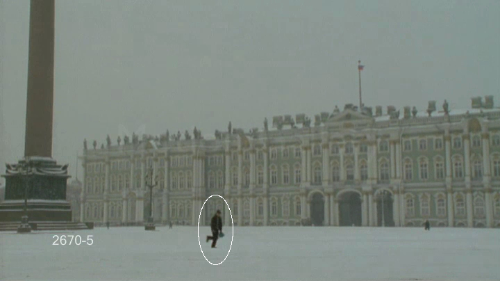

# KLT
KLT object tracking

   1- Find corner points based on the eigenvalues of the Hessian matrix.

   2- For each corner compute displacement to next frame using the Lucas-Kanade method

3. Store displacement of each corner, update corner positions.

4. Repeat 2 to 3

Algorithm needs initialization to select the first position of the object.

One problem for this algorithm is that anytime the object is going out of the ellipse, it needs initialization. 
One trick to solve this problem is to consider a larger box to find the desired corners to follow the object. 

